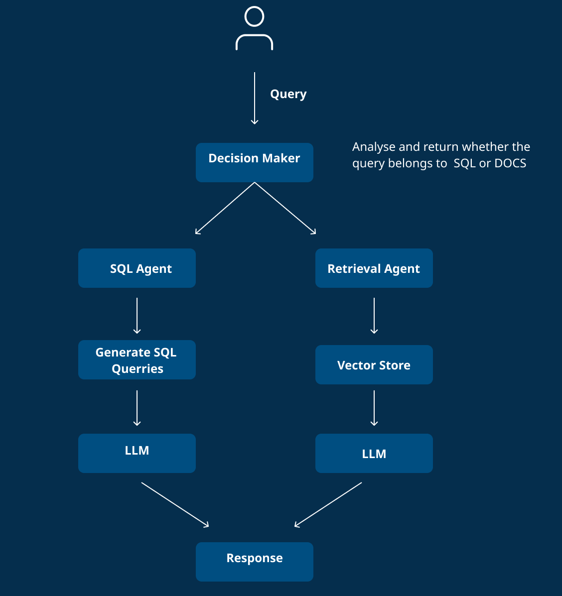

# Multi-Agent Architecture

A Multi-Agent system consists of multiple small agents configured to work together, allowing the system to utilize any agent based on the user's question. This architecture enhances flexibility and efficiency in handling diverse queries.

## Orchestrator Agent

- **Responsibility**: The Orchestrator Agent routes user questions to the appropriate agent (SQL Agent or Retrieval Agent) based on the content of the query.
- **Routing Logic**:
  - If the user question pertains to Amadis and Cloudadi, it should route to the Retrieval Agent.
  - If the user question is about resource details or database-related inquiries, it should route to the SQL Agent.
- **Example**: 
  - User asks, "What are the latest updates on Amadis?" → Routed to Retrieval Agent.
  - User asks, "Can you show me the details of the resources in the database?" → Routed to SQL Agent.

## SQL Agent

- **Functionality**: The SQL Agent utilizes Azure OpenAI (GPT-4o-mini) to generate SQL queries and responses. Local LLMs have been tested but often fail to generate accurate SQL queries and do not support tool calling/function calling in all cases.
- **Tools**:
    - `sql_db_list_tables`: Lists all SQL tables in the database.
    - `sql_db_schema`: Retrieves the schema of a specified table, taking the table name as input.
    - `sql_db_query`: Executes generated SQL queries and returns the results, taking the SQL query as input.
- **Workflow**:
  1. User Question → "List all tables in the database."
  2. SQL Agent retrieves the schema for tables related to the user question.
  3. Generates the SQL query.
  4. Executes the query.
  5. Returns the answer to the user.
- **Example**: 
  - User asks, "What tables are available in the database?" → SQL Agent lists tables.

## Retrieval Agent

- **Functionality**: The Retrieval Agent uses a local LLM to call the retrieval tool, fetch documents, and utilize them as context to answer user questions.
- **Tool**:
    - `retrieve_document`: This tool retrieves documents that answer the user query. The input is the query that needs to be searched.
- **Workflow**:
  1. User Question → "Find documents related to the latest trends in AI."
  2. The Retrieval Agent calls the retrieval tool.
  3. Retrieves relevant documents based on the query.
  4. Answers the user question using the retrieved documents as context.
- **Example**: 
  - User asks, "Can you provide documents on AI advancements?" → Retrieval Agent fetches relevant documents.

## Conclusion

The Multi-Agent Architecture provides a robust framework for handling various user queries efficiently by leveraging specialized agents. This system not only improves response accuracy but also enhances user experience by providing timely and relevant information.

