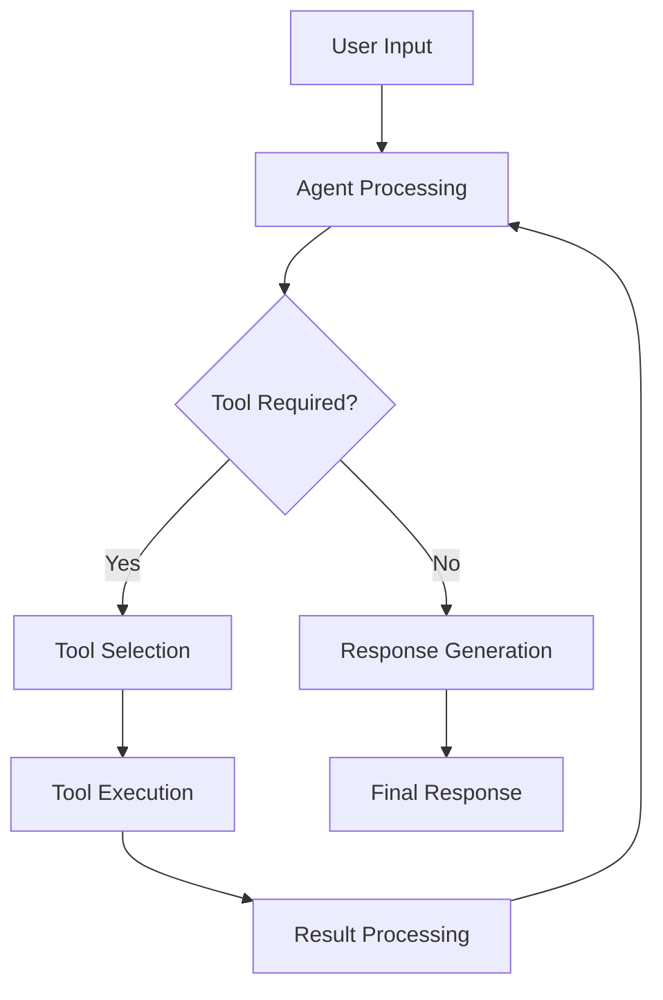

# Tools and Workflow

This document details the available tools in the React Agent system and explains how they interact in the workflow.

## Available Tools

### 1. SQL Database Tools

The SQL Database toolkit provides capabilities for database interactions:

```python
from langchain_community.agent_toolkits.sql.toolkit import SQLDatabaseToolkit
from langchain_community.utilities.sql_database import SQLDatabase

# Initialize SQL tools
db = SQLDatabase.from_uri(connection_string)
sql_toolkit = SQLDatabaseToolkit(db=db, llm=llm)
sql_tools = sql_toolkit.get_tools()
```

#### Available SQL Tools:
1. **sql_db_list_tables**
   - Lists available database tables
   - Usage: Schema exploration

2. **sql_db_schema**
   - Provides table schema information
   - Usage: Understanding table structure

3. **sql_db_query**
   - Executes SQL queries
   - Usage: Data retrieval and analysis

### 2. Document Retrieval Tool

```python
@tool
async def retrieve_documents(query: str) -> str:
    """
    Retrieve relevant documents from the vector store.
    
    Args:
        query (str): Search query
        
    Returns:
        str: Concatenated content from relevant documents
    """
    retriever = vector_store.as_retriever(
        search_type="similarity",
        search_kwargs={"k": 5}
    )
    
    docs = await retriever.ainvoke(query)
    return format_documents(docs)
```

Features:
- Similarity search
- Configurable result count
- Async operation
- Document formatting

### 3. Custom Tools

Example of a custom tool implementation:

```python
class CustomTool(BaseTool):
    name = "custom_tool"
    description = "Tool description"
    
    def _run(self, query: str) -> str:
        # Implementation
        return result
        
    async def _arun(self, query: str) -> str:
        # Async implementation
        return result
```

## Tool-to-Tool Flow

### 1. Flow Sequence



### 2. Tool Selection Process

1. **Input Analysis**
   ```python
   def analyze_input(state: AgentState) -> bool:
       last_message = state["messages"][-1]
       return bool(last_message.tool_calls)
   ```

2. **Tool Matching**
   ```python
   def match_tool(tool_call: ToolCall) -> BaseTool:
       return tools_by_name[tool_call.name]
   ```

3. **Argument Preparation**
   ```python
   def prepare_args(tool_call: ToolCall) -> dict:
       return tool_call.arguments
   ```

### 3. Tool Execution Flow

1. **Pre-execution**
   ```python
   async def prepare_tool(tool: BaseTool, args: dict) -> dict:
       # Validate and prepare arguments
       return validated_args
   ```

2. **Execution**
   ```python
   async def execute_tool(tool: BaseTool, args: dict) -> Any:
       try:
           return await tool.ainvoke(args)
       except Exception as e:
           return handle_tool_error(e)
   ```

3. **Post-execution**
   ```python
   def process_result(result: Any) -> str:
       # Format and validate result
       return formatted_result
   ```

## Tool Integration Patterns

### 1. Sequential Tools

```python
async def sequential_execution(tools: List[BaseTool], input_data: str):
    result = input_data
    for tool in tools:
        result = await tool.ainvoke(result)
    return result
```

### 2. Parallel Tools

```python
async def parallel_execution(tools: List[BaseTool], input_data: str):
    tasks = [tool.ainvoke(input_data) for tool in tools]
    results = await asyncio.gather(*tasks)
    return combine_results(results)
```

### 3. Conditional Tools

```python
async def conditional_execution(state: AgentState, tools: Dict[str, BaseTool]):
    tool_name = determine_tool(state)
    if tool_name in tools:
        return await tools[tool_name].ainvoke(state["input"])
    return default_response()
```

## Tool Configuration

### 1. Basic Configuration

```python
tool_config = {
    "name": "tool_name",
    "description": "Tool description",
    "parameters": {
        "param1": {"type": "string", "description": "Parameter description"}
    }
}
```

### 2. Advanced Configuration

```python
class ToolConfig:
    def __init__(self, tool: BaseTool):
        self.tool = tool
        self.config = self._load_config()
        
    def configure(self, **kwargs):
        self.tool.update_config(**kwargs)
        
    def validate(self):
        return self._validate_config()
```

## Best Practices

### 1. Tool Design
- Single responsibility principle
- Clear documentation
- Error handling
- Performance optimization

### 2. Tool Integration
- Proper validation
- Resource management
- Error propagation
- State handling

### 3. Tool Flow
- Clear routing logic
- State management
- Error recovery
- Performance monitoring

## Common Patterns

### 1. Tool Chaining

```python
class ToolChain:
    def __init__(self, tools: List[BaseTool]):
        self.tools = tools
        
    async def execute(self, input_data: str):
        result = input_data
        for tool in self.tools:
            result = await tool.ainvoke(result)
        return result
```

### 2. Tool Composition

```python
class ComposedTool(BaseTool):
    def __init__(self, tools: List[BaseTool]):
        self.tools = tools
        
    async def _arun(self, input_data: str):
        results = []
        for tool in self.tools:
            results.append(await tool.ainvoke(input_data))
        return self.combine_results(results)
```

### 3. Tool Fallback

```python
class FallbackTool(BaseTool):
    def __init__(self, primary: BaseTool, fallback: BaseTool):
        self.primary = primary
        self.fallback = fallback
        
    async def _arun(self, input_data: str):
        try:
            return await self.primary.ainvoke(input_data)
        except Exception:
            return await self.fallback.ainvoke(input_data)
```

## Next Steps

For detailed API documentation and reference, proceed to the [API Reference](./05_api_reference.md) section. 