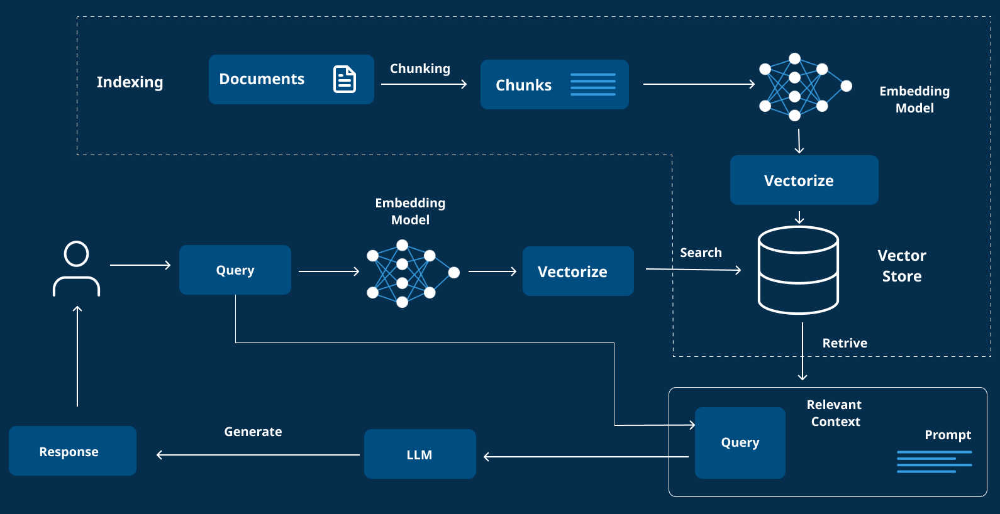

# Retrieval-Augmented Generation (RAG): An Overview

## Table of Contents

- [What is RAG?](#what-is-rag)
- [Components of RAG](#components-of-rag)
  - [Retriever](#retriever)
  - [Generator](#generator)
- [Types of Knowledge Sources](#types-of-knowledge-sources)
- [How RAG Works](#how-rag-works)
- [Advantages of RAG](#advantages-of-rag)
- [Challenges and Considerations](#challenges-and-considerations)
- [Applications of RAG](#applications-of-rag)
- [Conclusion](#conclusion)

## What is RAG?

Retrieval-Augmented Generation (RAG) is a cutting-edge approach in natural language processing (NLP) that blends retrieval-based and generation-based techniques to enhance the capabilities of language models. Unlike traditional language models that rely solely on their pre-trained internal knowledge—which can sometimes be outdated or incomplete—RAG integrates a retrieval mechanism. This allows the model to access external knowledge sources, such as databases, documents, or the internet, to produce responses that are more accurate, relevant, and informed.

In a RAG system, the process begins when a user submits a query or prompt. The system's retriever searches through external knowledge sources to find relevant information. This information is then passed to the generator, typically a large language model, which crafts a coherent and contextually appropriate response based on both the user's input and the retrieved data. This hybrid method makes RAG particularly valuable for applications requiring real-time data, domain-specific expertise, or factual grounding.

_Figure 1: Basic architecture of a RAG system showing the flow from user query through retrieval to generation_

## Components of RAG

A RAG system is built around two core components that work together seamlessly:

### Retriever

The retriever is tasked with finding and extracting relevant information from external knowledge sources based on the user's input. It can process various data types, including:

- **Structured data**: Such as SQL databases, where it might execute queries to fetch specific records.
- **Unstructured data**: Like text documents (e.g., PDFs or Word files), where it searches for pertinent passages.
- **Web-based data**: Including websites, where it might scrape content or use APIs to gather information.

The retriever employs techniques such as keyword matching, semantic search, or advanced methods like dense vector retrieval to identify the most relevant content.

### Generator

The generator is a language model (e.g., GPT-3 or similar) that takes the retrieved information and the original user query to produce a natural language response. It synthesizes the retrieved data—often by combining it with the query—into a fluent and meaningful answer. The generator ensures that the output is not only factually informed but also stylistically appropriate.

> **Key Insight**: The synergy between the retriever and generator is key: the retriever supplies the facts, while the generator shapes them into a user-friendly response.

## Types of Knowledge Sources

RAG's strength lies in its ability to tap into diverse external knowledge sources, including:

- **Databases**: Structured repositories like SQL databases, where specific data can be retrieved via queries. For example, a RAG system might pull sales figures or customer details from a database.

- **Documents**: Unstructured or semi-structured files such as PDFs, text documents, or reports, searched for relevant text snippets using techniques like embeddings or keyword extraction.

- **Websites**: Online content accessed through web scraping, APIs, or search engines, providing up-to-date information from the internet.

- **Vector Stores**: Specialized databases that store vector embeddings of documents or chunks, optimized for semantic similarity searches.

This flexibility allows RAG to adapt to a wide range of applications by leveraging the most appropriate sources for the task at hand.

## How RAG Works

The RAG process can be broken down into a clear sequence of steps:

1. **User Input**: The user provides a query, such as a question or a request for information (e.g., "What are the latest sales figures?").

2. **Retrieval**: The retriever analyzes the query and searches the designated knowledge sources. Depending on the source, this could involve:

   - Running an SQL query on a database
   - Scanning a document index for matching passages
   - Querying a website via an API or scraping its content
   - Performing vector similarity search in an embedding database

3. **Information Selection**: The retriever ranks and selects the most relevant pieces of information, often using relevance scoring.

4. **Generation**: The generator combines the retrieved data with the original query to create a response, ensuring it is both accurate and well-phrased.

5. **Response Output**: The final response is delivered to the user, grounded in the retrieved information.
   L
   This workflow enables RAG to dynamically incorporate external data into its responses, making it more robust than standalone language models.

## Advantages of RAG

RAG offers several compelling benefits over traditional language models:

- **Access to External Knowledge**: It draws from a vast and varied pool of information beyond the model's training data.

- **Improved Accuracy**: By anchoring responses in retrieved facts, RAG reduces errors and "hallucinations" (fabricated information).

- **Up-to-Date Information**: It can pull the latest data from sources like websites or databases, keeping responses current.

- **Domain-Specific Expertise**: Tailoring knowledge sources allows RAG to excel in specialized fields like medicine, law, or technology.

- **Versatility**: Its ability to handle multiple data types makes it adaptable to diverse use cases.

- **Transparency**: The retrieved sources can be cited, making the system's responses more traceable and verifiable.

## Challenges and Considerations

While powerful, RAG comes with some challenges that need to be addressed:

- **Relevance of Retrieved Information**: The retriever must accurately identify truly relevant data to avoid misleading or off-topic responses.

- **Managing Multiple Sources**: Integrating and prioritizing information from various origins can be complex.

- **Computational Efficiency**: Searching and processing external sources can demand significant resources, especially at scale.

- **Data Privacy and Security**: When accessing sensitive data (e.g., in databases), safeguards are essential to protect user information.

- **Latency Issues**: The retrieval step adds time to the response generation process, potentially impacting user experience.

- **Content Freshness**: Managing the update frequency of knowledge sources to ensure information remains current.

## Applications of RAG

RAG's versatility makes it suitable for a wide range of applications, including:

- **Question Answering**: Delivering precise answers by pulling data from knowledge bases (e.g., "What's the population of France?").

- **Information Retrieval**: Helping users locate specific details within large datasets or document collections.

- **Conversational Agents**: Powering chatbots or virtual assistants that provide informed, context-aware responses by accessing external sources.

- **Content Creation**: Assisting writers with fact-checked, up-to-date information for articles, reports, or documentation.

- **Research Assistance**: Supporting researchers by retrieving relevant studies, papers, or data points based on specific queries.

- **Enterprise Search**: Enhancing organizational knowledge management by providing accurate information from company documents and databases.

## Conclusion

Retrieval-Augmented Generation (RAG) is a transformative technique that enhances language models by combining retrieval and generation capabilities. By leveraging external knowledge sources like databases, documents, and websites, RAG delivers responses that are more accurate, current, and relevant than those from traditional models.

Though it faces challenges like ensuring data relevance and managing computational demands, its potential is vast, spanning question answering, information retrieval, and conversational systems. As RAG systems continue to evolve, we can expect even more sophisticated applications that bridge the gap between static knowledge and dynamic, contextual understanding.
